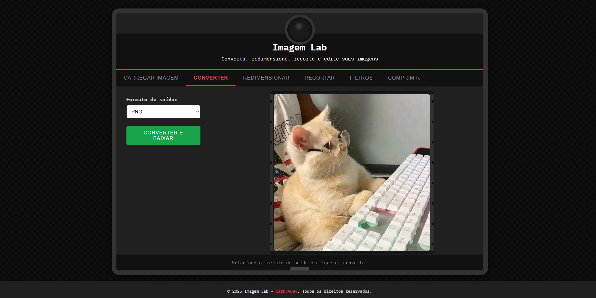

# 🧪 Imagem Lab – Editor de Imagens Mágico 🔮

**Imagem Lab** é uma ferramenta web desenvolvida como **um projeto de estudo** para praticar a manipulação de imagens no navegador usando **HTML, CSS e JavaScript** (Vanilla JS). A proposta principal é explorar e implementar funcionalidades de edição de imagem de forma interativa e acessível, sem a necessidade de servidores externos.

## 🖼️ Preview do Projeto

Aqui está um preview do **Imagem Lab** em funcionamento:




## ✨ Funcionalidades

- 📤 **Upload de Imagens**: Arraste e solte ou selecione arquivos diretamente do seu dispositivo.
- 🔄 **Conversão de Formato**: Converta suas imagens entre os formatos PNG, JPG e WEBP.
- 📏 **Redimensionamento**: Ajuste a largura e altura da imagem com a opção de manter a proporção.
- ✂️ **Recorte de Imagens**: Selecione e recorte uma área específica da imagem.
- 🎨 **Filtros e Ajustes**:
  - Ajuste de brilho, contraste e saturação.
  - Aplicação de filtros como **Preto e Branco**, **Sépia**, **Vintage**, entre outros.
- 📦 **Compressão**: Reduza o tamanho das imagens ajustando a qualidade.

## 🧠 Sobre o Projeto

Este projeto foi desenvolvido **exclusivamente com fins de estudo e aprendizado**. Durante o desenvolvimento, explorei conceitos como:

- **Manipulação de imagens no navegador** utilizando a **Canvas API**.
- **Interações dinâmicas** e **interface com abas** para melhorar a experiência do usuário.
- Boas práticas de **organização e responsividade** em HTML e CSS.

> **Aviso:** O **Imagem Lab** não é uma aplicação comercial e não está destinado ao uso em produção. Ele serve como um exercício prático e experimental para o entendimento de técnicas de frontend e manipulação de imagens.

## 🚀 Tecnologias Utilizadas

- **HTML5**
- **CSS3**
- **JavaScript (Vanilla)**
- **Google Fonts** – [IBM Plex Mono](https://fonts.google.com/specimen/IBM+Plex+Mono)

## 🛠️ Como Usar

1. Clone este repositório:
   ```bash
   git clone https://github.com/NathCADev/imagem-lab.git

2. Abra o arquivo index.html no seu navegador.

3. Comece a testar as ferramentas e edições de imagem!

